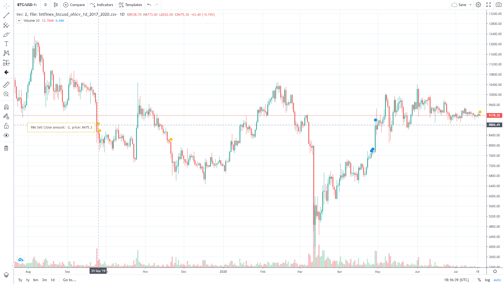
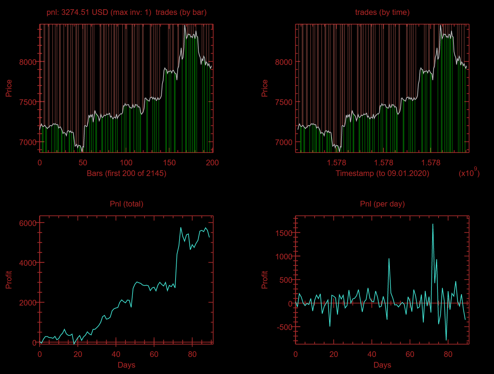
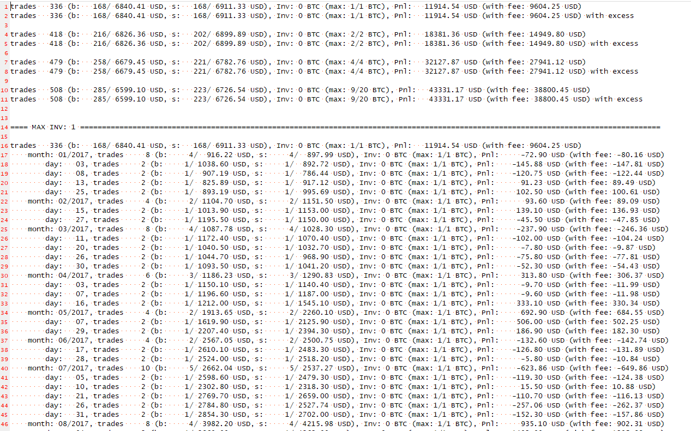
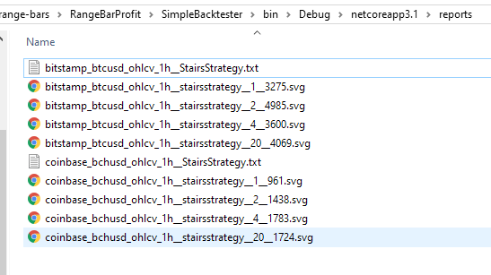

```
██████   █████   ██████ ██   ██ ████████ ███████ ███████ ████████ ███████ ██████ 
██   ██ ██   ██ ██      ██  ██     ██    ██      ██         ██    ██      ██   ██
██████  ███████ ██      █████      ██    █████   ███████    ██    █████   ██████ 
██   ██ ██   ██ ██      ██  ██     ██    ██           ██    ██    ██      ██   ██
██████  ██   ██  ██████ ██   ██    ██    ███████ ███████    ██    ███████ ██   ██
```

# Simple Backtester [](https://travis-ci.com/github/Marfusios/simple-backtester) 

A very simple backtesting application for OHLC data (range bars)

### License: 
    MIT

### Features

* cross platform
* chart and text report
* integrated TradingView charting library

 
 



### Usage

#### Data as CSV files
* minimal required columns: 
    * date and time, one of: 
        * `timestamp_unix` - unix seconds or milliseconds
        * `date` or `timestamp` - human readable string parsed via `DateTime.Parse()`
    * `mid` or `close` - last price
* additional columns (nice-to-have):
    * `bid` - last bid/buy price
    * `ask` - last ask/sell price

#### Strategy
Write strategy that implements interface `IStrategy`, see example [ones](SimpleBacktester/Strategies)

#### Configuration
Configure app via json file, see example [appsettings.json](SimpleBacktester/appsettings.json)


---

**Pull Requests are welcome!**


### Available for help
I do consulting, please don't hesitate to contact me if you have a custom solution you would like me to implement ([web](http://mkotas.cz/), 
<m@mkotas.cz>)

Donations gratefully accepted.
* [](https://en.cryptobadges.io/donate/1HfxKZhvm68qK3gE8bJAdDBWkcZ2AFs9pw)
* [](https://en.cryptobadges.io/donate/LftdENE8DTbLpV6RZLKLdzYzVU82E6dz4W)
* [](https://en.cryptobadges.io/donate/0xb9637c56b307f24372cdcebd208c0679d4e48a47)
